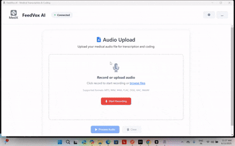

<div align="center">
  
  # 🩺 **FeedVox AI**
  ### *Advanced Medical Transcription & Coding Suite*
  
  <p align="center">
    <strong>🤖 AI-Powered Medical Documentation System</strong><br/>
    Transform medical audio recordings into structured clinical notes with automatic<br/>
    <strong>ICD-10 • CPT • SNOMED-CT</strong> coding using cutting-edge AI technology
  </p>
  
  <br/>
  
  ### 🎬 **Live Demo**
  
  
  
  <p align="center">
    <em>🎯 Quick GIF Preview: See FeedVox AI workflow in action</em>
  </p>
  
  <br/>
  
  <video width="800" controls>
    <source src="video demo/15.06.2025_11.27.12_REC.mp4" type="video/mp4">
    Your browser does not support the video tag.
  </video>
  <a src="https://github.com/AjnasNB/feedvox-ai/blob/master/video%20demo/15.06.2025_11.27.12_REC.mp4" >https://github.com/AjnasNB/feedvox-ai/blob/master/video%20demo/15.06.2025_11.27.12_REC.mp4</a>
  <p align="center">
    <em>📹 Full Video Demo: Audio upload → AI transcription → Medical note generation → Automatic coding</em>
  </p>
  
  <br/>
  
  <p align="center">
    
    
    
    
  </p>
  
  <p align="center">
    <a href="#-quick-start-summary"></a>
    <a href="#-application-usage"></a>
    <a href="#-api-documentation"></a>
    <a href="#-troubleshooting"></a>
  </p>
  
  <br/>
  
  ---
  
</div>

## 📋 Table of Contents

<table>
<tr>
<td width="50%">

### 🎯 **Getting Started**
- [🔬 Purpose & Overview](#-purpose--overview)
- [💻 Hardware Requirements](#-hardware-requirements)
- [🛠️ Software Requirements](#-software-requirements)
- [🚀 Installation Guide](#-installation-guide)
- [🤖 AnythingLLM Setup](#-anythingllm-setup)

</td>
<td width="50%">

### 📱 **Usage & Support**
- [📱 Application Usage](#-application-usage)
- [🔗 API Documentation](#-api-documentation)
- [🔧 Troubleshooting](#-troubleshooting)
- [⚡ Performance Optimization](#-performance-optimization)
- [📄 License & Support](#-license--support)

</td>
</tr>
</table>

## 🎯 Purpose & Overview

<div align="center">
  <h3>🏥 <strong>Comprehensive Medical Documentation Platform</strong></h3>
  <p><em>Streamline clinical workflows by automatically converting audio recordings into structured medical notes with accurate medical coding</em></p>
</div>

<br/>

<table>
<tr>
<td width="50%" valign="top">

### 🔬 **Core Capabilities**

🎤 **High-Accuracy Speech Recognition**  
*OpenAI Whisper-based medical audio transcription*

🧠 **AI Medical Note Extraction**  
*Intelligent parsing of medical information using LLM*

🏥 **Automatic Medical Coding**  
*ICD-10, CPT, and SNOMED-CT code assignment*

💻 **Cross-Platform Desktop App**  
*Beautiful Electron-based user interface*

🔗 **REST API Integration**  
*Complete backend API for healthcare systems*

📊 **Real-Time Processing**  
*Live progress tracking and status updates*

</td>
<td width="50%" valign="top">

### 🎯 **Target Use Cases**

👨‍⚕️ **Medical Practitioners**  
*Documenting patient encounters efficiently*

🏥 **Healthcare Facilities**  
*Automating clinical documentation workflows*

📋 **Medical Coders**  
*AI-assisted code assignment and validation*

🖥️ **Healthcare IT Systems**  
*Transcription integration and interoperability*

🔬 **Clinical Research**  
*Structured data extraction from recordings*

📊 **Quality Assurance**  
*Standardized documentation processes*

</td>
</tr>
</table>

## 💻 Hardware Requirements

### 🖥️ **Recommended Configuration (Tested)**
```
Device: ThinkPad Notebook with NPU Acceleration
Chip: Snapdragon X Elite (Qualcomm)
OS: Windows 11 (Build 22000+)
Memory: 32 GB RAM
Storage: 512 GB+ SSD (for model storage)
Audio: Built-in microphone or external recording device
```

### ⚡ **NPU Acceleration Benefits:**
- **Faster LLM Inference** - Qualcomm QNN optimized for Snapdragon X Elite
- **Lower Power Consumption** - Dedicated neural processing unit
- **Better Performance** - Hardware-accelerated AI model execution
- **Local Processing** - All AI computation happens on-device

### 📱 **Minimum Requirements:**
```
OS: Windows 10/11, macOS 10.15+, or Linux (Ubuntu 20.04+)
RAM: 8 GB (16 GB+ recommended)
Storage: 10 GB available space
CPU: Intel i5/AMD Ryzen 5 or equivalent
Audio: Microphone for recording (optional)
Network: Internet connection for initial setup
```

## 🛠️ Software Requirements

### 🐍 **Core Dependencies:**
```
Python: 3.11.x (recommended)
Node.js: 18.0+ (for Electron UI)
npm: 9.0+ (comes with Node.js)
Git: Latest version
```

### 🤖 **AI Platform Integration:**
```
AnythingLLM Platform: Latest version
LLM Provider: Qualcomm QNN (for NPU acceleration)
Chat Model: Llama 3.2 3B Chat 8K Context
Transcription: OpenAI Whisper (multiple model sizes)
```

### 📚 **Python Libraries:**
- **FastAPI** - Backend API framework
- **OpenAI Whisper** - Speech-to-text transcription
- **SQLAlchemy** - Database ORM
- **Pandas** - Data processing for medical codes
- **Sentence Transformers** - Text embeddings
- **FuzzyWuzzy** - Medical term matching

## 🚀 Installation Guide

### **Step 1: Clone the Repository**
```bash
# Clone the FeedVox AI repository
git clone https://github.com/AjnasNB/feedvox-ai.git

# Navigate to project directory
cd feedvox.ai
```

### **Step 2: Set Up Python Environment**
```bash
# Create Python virtual environment
python -m venv venv

# Activate virtual environment
# Windows:
venv\Scripts\activate
# macOS/Linux:
source venv/bin/activate

# Upgrade pip
python -m pip install --upgrade pip

# Install Python dependencies
pip install -r requirements.txt
```

### **Step 3: Install Node.js Dependencies**
```bash
# Navigate to UI directory
cd ui

# Install Node.js dependencies
npm install

# Install Electron dependencies
npm run postinstall

# Return to project root
cd ..
```

### **Step 4: Verify Installation**
```bash
# Test Python backend
python main.py

# In another terminal, test UI
cd ui && npm start
```

## 🤖 AnythingLLM Setup

### **Step 1: Install AnythingLLM**
1. **Download AnythingLLM** from [official website](https://anythingllm.com)
2. **Run the installer** and complete setup
3. **Launch AnythingLLM** application

### **Step 2: Configure LLM Provider**
1. **Open AnythingLLM** application
2. **Navigate to Settings** (gear icon)
3. **Select "LLM Preference"**
4. **Choose Provider**: Select **"Qualcomm QNN"**
5. **Configure NPU Settings** for Snapdragon X Elite optimization

### **Step 3: Select Chat Model**
1. **In LLM Settings**, click **"Select Model"**
2. **Choose**: **Llama 3.2 3B Chat** (8K context)
3. **Download Model** (this may take 10-15 minutes)
4. **Verify Model** is loaded successfully

### **Step 4: Create Workspace**
1. **Click "+ New Workspace"** on the main screen
2. **Name**: `medical` or `feedvox-workspace`
3. **Description**: `Medical transcription and coding workspace`
4. **Click "Create Workspace"**

### **Step 5: Generate API Key**
1. **Click the settings button** (bottom left panel)
2. **Open "Tools" dropdown**
3. **Click "Developer API"**
4. **Click "Generate New API Key"**
5. **Copy the API key** (save it securely)

### **Step 6: Configure FeedVox AI**
```yaml
# Edit config.yaml in project root
api_key: "your-generated-api-key-here"
model_server_base_url: "http://localhost:3001/api/v1"
workspace_slug: "medical"

# Audio Processing Configuration
audio:
  sample_rate: 16000
  chunk_duration: 4.0
  language: "en"
  model_size: "base.en"  # or "small.en", "medium.en", "large"

# Medical Coding Settings
medical_coding:
  confidence_threshold: 0.7
  max_codes_per_type: 10
  enable_fuzzy_matching: true
```

## 📱 Application Usage

### **Starting the Application**

#### **Option 1: Quick Start (Recommended)**
```bash
# Windows - Double-click or run:
start_feedvox.bat

# This will automatically:
# ✅ Check dependencies
# ✅ Start AnythingLLM (if not running)
# ✅ Start backend API server
# ✅ Launch desktop application
```

#### **Option 2: Manual Start**
```bash
# Terminal 1: Start Backend
python main.py

# Terminal 2: Start UI
cd ui && npm start
```

### **Using the Desktop Application**

#### **1. Audio Upload & Processing**
1. **Launch Application** - FeedVox AI window opens
2. **Upload Audio File**:
   - **Drag & Drop** audio file into upload area
   - **Click "Browse"** to select file
   - **Supported Formats**: WAV, MP3, M4A, FLAC, OGG, WMA
   - **File Size Limit**: 500MB (recommended < 100MB for faster processing)

3. **Start Processing**:
   - **Click "Process Audio"** button
   - **Monitor Progress**: Real-time progress bar and status updates
   - **Processing Steps**:
     - 🎤 Audio file validation and preprocessing
     - 🧠 Whisper speech-to-text transcription
     - 📝 AI-powered medical note extraction
     - 🏥 Automatic medical code assignment

#### **2. Viewing Results**

**📝 Transcript Tab:**
- Raw transcription text from Whisper
- Confidence scores and timestamps
- Edit capability for corrections

**🏥 Medical Note Tab:**
- **Chief Complaint** - Primary reason for visit
- **History of Present Illness** - Detailed symptom history
- **Past Medical History** - Previous conditions and treatments
- **Medications** - Current and previous medications
- **Allergies** - Known allergies and reactions
- **Social History** - Lifestyle factors
- **Family History** - Relevant family medical history
- **Vital Signs** - Recorded measurements
- **Physical Examination** - Clinical findings
- **Assessment** - Clinical impression and diagnosis
- **Plan** - Treatment plan and follow-up

**📊 Medical Codes Tab:**
- **ICD-10 Codes** - Diagnostic codes with descriptions
- **CPT Codes** - Procedure codes for billing
- **SNOMED-CT Codes** - Clinical terminology codes
- **Confidence Scores** - AI confidence in code assignment (0-100%)

#### **3. Exporting Results**

**Copy to Clipboard:**
- Individual section copy buttons
- Complete note copy option
- Medical codes copy (formatted for EHR)

**Save to Files:**
- **Export Transcript** - Save as .txt file
- **Export Medical Note** - Save as structured .json or .txt
- **Export Codes** - Save as .csv for billing systems

### **Advanced Features**

#### **Batch Processing**
```bash
# Process multiple files via API
curl -X POST "http://localhost:7717/api/v1/transcription/batch" \
  -F "files=@audio1.wav" \
  -F "files=@audio2.mp3" \
  -F "files=@audio3.m4a"
```

#### **Real-Time Recording**
- **Click microphone icon** to start live recording
- **Speak clearly** into microphone
- **Click stop** to end recording and process

#### **Custom Vocabularies**
- Add medical terms to improve recognition
- Configure specialty-specific vocabularies
- Import custom medical dictionaries

## 🔗 API Documentation

### **Backend API Endpoints**

**Base URL:** `http://localhost:7717`

#### **Health & Status**
```http
GET /health
GET /status
GET /api/v1/system/info
```

#### **Audio Transcription**
```http
POST /api/v1/transcription/upload
Content-Type: multipart/form-data
Body: audio_file (file)

Response:
{
  "success": true,
  "transcription_id": "uuid",
  "text": "transcribed text",
  "duration_seconds": 120.5,
  "confidence_score": 0.95,
  "model_used": "whisper-base.en"
}
```

#### **Medical Note Extraction**
```http
POST /api/v1/notes/extract
Content-Type: application/json
Body: {"transcript_text": "medical transcription text"}

Response:
{
  "success": true,
  "note_id": "uuid",
  "medical_note": {
    "chief_complaint": "extracted complaint",
    "history_present_illness": "extracted history",
    // ... other medical sections
  },
  "medical_codes": {
    "icd_codes": [{"code": "R07.89", "description": "Other chest pain", "confidence": 0.85}],
    "cpt_codes": [{"code": "99213", "description": "Office visit", "confidence": 0.90}],
    "snomed_codes": []
  }
}
```

#### **Medical Codes Search**
```http
GET /api/v1/medical-codes/search?query=chest+pain&limit=10

Response:
{
  "results": [
    {
      "type": "icd",
      "code": "R07.89",
      "description": "Other chest pain",
      "score": 95
    }
  ],
  "total_results": 1
}
```

### **Interactive API Documentation**
- **Swagger UI**: http://localhost:7717/docs
- **ReDoc**: http://localhost:7717/redoc

## 🔧 Troubleshooting

### **Common Issues & Solutions**

#### **🚫 Backend Won't Start**

**Issue**: `Python executable not found`
```bash
# Solution: Verify Python installation
python --version
# Should show: Python 3.11.x

# If not installed, download from python.org
# Ensure Python is in system PATH
```

**Issue**: `Port 7717 already in use`
```bash
# Solution: Kill existing process
# Windows:
netstat -ano | findstr :7717
taskkill /PID <PID_NUMBER> /F

# macOS/Linux:
lsof -ti:7717 | xargs kill -9
```

**Issue**: `Module not found errors`
```bash
# Solution: Reinstall dependencies
pip install --force-reinstall -r requirements.txt
```

#### **🖥️ UI Won't Launch**

**Issue**: `Electron failed to start`
```bash
# Solution: Rebuild Electron
cd ui
rm -rf node_modules
npm install
npm run postinstall
```

**Issue**: `Backend connection refused`
- **Check**: Backend is running on http://localhost:7717
- **Verify**: Backend health at http://localhost:7717/health
- **Solution**: Restart backend with `python main.py`

#### **🤖 AnythingLLM Issues**

**Issue**: `LLM service unavailable`
1. **Verify AnythingLLM is running** (check http://localhost:3001)
2. **Check API key** in config.yaml
3. **Restart AnythingLLM** application
4. **Verify workspace** exists and is accessible

**Issue**: `Model loading failed`
1. **Check available storage** (models require 2-8GB)
2. **Verify NPU drivers** are installed for Snapdragon X Elite
3. **Try smaller model** (Llama 3.2 1B instead of 3B)

#### **🎤 Audio Processing Issues**

**Issue**: `Audio format not supported`
- **Solution**: Convert to supported format (WAV, MP3, M4A, FLAC, OGG)
- **Tool**: Use FFmpeg for conversion
```bash
ffmpeg -i input.aac output.wav
```

**Issue**: `Transcription quality poor`
- **Check audio quality** (clear speech, minimal background noise)
- **Use higher quality model** (medium.en or large.en)
- **Ensure proper microphone setup**

**Issue**: `Processing very slow`
- **Check system resources** (CPU, RAM usage)
- **Use smaller Whisper model** (base.en instead of large.en)
- **Process shorter audio segments** (< 10 minutes per file)

#### **🏥 Medical Coding Issues**

**Issue**: `No medical codes generated`
1. **Check medical codes database** is loaded
2. **Verify CSV files** in `mecial codes/` directory
3. **Check confidence threshold** in config.yaml
4. **Restart backend** to reload code database

**Issue**: `Incorrect code assignments`
- **Review medical note extraction** quality
- **Adjust confidence threshold** (lower for more codes, higher for precision)
- **Add custom medical vocabularies**

### **🔧 Advanced Debugging**

#### **Enable Debug Logging**
```bash
# Set environment variable for detailed logs
export FEEDVOX_DEBUG=true
python main.py

# Windows:
set FEEDVOX_DEBUG=true
python main.py
```

#### **Check System Resources**
```bash
# Monitor CPU, RAM, and disk usage
# Windows:
taskmgr

# macOS:
Activity Monitor

# Linux:
htop
```

#### **Validate Audio Files**
```bash
# Check audio file properties
ffprobe audio_file.wav

# Convert problematic files
ffmpeg -i input.mp3 -ar 16000 -ac 1 output.wav
```

### **📞 Getting Help**

**Before Reporting Issues:**
1. ✅ Check this troubleshooting section
2. ✅ Review application logs in console
3. ✅ Test with sample audio files
4. ✅ Verify all dependencies are installed
5. ✅ Check system requirements are met

**Support Resources:**
- **GitHub Issues**: Report bugs and feature requests
- **API Documentation**: http://localhost:7717/docs
- **Log Files**: Check console output for error details

## ⚡ Performance Optimization

### **🚀 Hardware Optimization**

**For Snapdragon X Elite (NPU):**
- **Enable QNN Provider** in AnythingLLM for NPU acceleration
- **Use optimized models** designed for Qualcomm NPU
- **Monitor NPU utilization** in Task Manager

**Memory Optimization:**
```yaml
# config.yaml optimizations
audio:
  chunk_duration: 2.0  # Smaller chunks for limited RAM
  model_size: "base.en"  # Smaller model for faster processing

medical_coding:
  confidence_threshold: 0.8  # Higher threshold = fewer results = faster
  max_codes_per_type: 5  # Limit results for speed
```

### **🎯 Audio Processing Tips**

**Optimal Audio Settings:**
- **Sample Rate**: 16 kHz (reduces processing time)
- **Channels**: Mono (single channel)
- **Format**: WAV (uncompressed, fastest processing)
- **Duration**: < 10 minutes per file (optimal performance)

**Quality vs Speed Trade-offs:**
```
Whisper Model    | Speed | Accuracy | RAM Usage
base.en         | Fast  | Good     | 1 GB
small.en        | Medium| Better   | 2 GB
medium.en       | Slow  | Best     | 5 GB
large.en        | Slowest| Excellent| 10 GB
```

### **🔧 System Optimization**

**Windows 11 Specific:**
- **Enable High Performance mode** in Power Options
- **Disable unnecessary startup programs**
- **Ensure Windows is updated** for latest NPU drivers
- **Use SSD storage** for model and data files

**Resource Monitoring:**
- **RAM Usage**: Keep < 80% for optimal performance
- **CPU Usage**: Monitor during processing
- **Disk Space**: Ensure 5+ GB free for temporary files

## 📄 License & Support

### **📜 License**
This project is licensed under the **MIT License** - see the [LICENSE](LICENSE) file for details.

### **🤝 Contributing**
We welcome contributions! Please see our [Contributing Guidelines](CONTRIBUTING.md) for details.

### **📚 Additional Resources**
- **Official Documentation**: [FeedVox AI Docs](https://docs.feedvox.ai)
- **Video Tutorials**: [YouTube Playlist](https://youtube.com/feedvox-ai)
- **Community Forum**: [Discord Server](https://discord.gg/feedvox-ai)

### **⭐ Acknowledgments**
- **OpenAI Whisper** - Speech recognition technology
- **Qualcomm** - NPU acceleration and QNN framework
- **AnythingLLM** - LLM integration platform
- **Medical Coding Standards** - ICD-10, CPT, SNOMED-CT organizations

---

## 🚀 Quick Start Summary

```bash
# 1. Clone repository
git clone https://github.com/AjnasNB/feedvox.ai.git
cd feedvox.ai

# 2. Set up Python environment
python -m venv venv
venv\Scripts\activate  # Windows
pip install -r requirements.txt

# 3. Set up UI
cd ui && npm install && cd ..

# 4. Configure AnythingLLM (see detailed steps above)

# 5. Start application
python main.py  # Backend
cd ui && npm start  # UI (in another terminal)

# 6. Upload audio and start processing!
```

**🎉 You're ready to transform medical audio into structured, coded documentation with FeedVox AI!**

---

**FeedVox AI** - *Revolutionizing medical documentation with AI-powered transcription and coding* 🏥✨ 